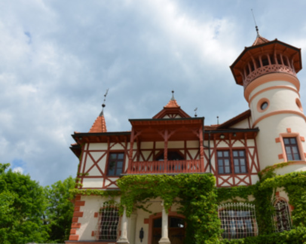
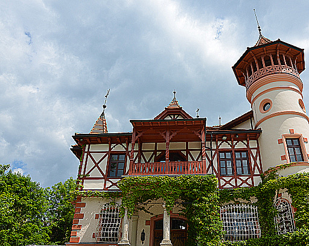
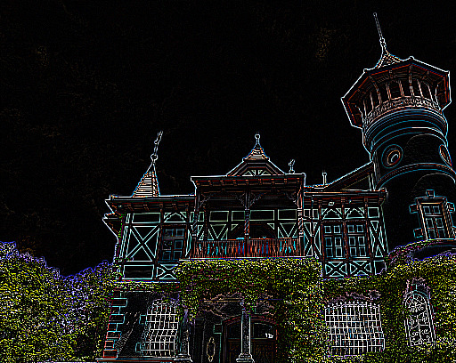

# OpenCL Experiments

This repo goes through 2 OpenCL tutorials to lean how OpenCL programs are built and executed. The following tutorials are here:

- Filtering: https://anteru.net/blog/2012/11/03/2009/
- Matrix multiplication: http://gpgpu-computing4.blogspot.com/2009/09/matrix-multiplication-2-opencl.html

## Instructions

Here are instructions to execute our programs.

```bash
# First, run cmake to create our Makefile.
cmake CMakeLists.txt

# For image filtering, run
make && ./gpu_comparch_final

# For matrix multiplication, run
make && ./matrix_mul
```

## Image Processing

With our current implementation of image processing, we can apply convolution kernels to our images in parallel. In `main.cpp`, the section immediately after `FILTER PROGRAM` contains a set of (commented-out) filters for your use. This is the filter that gets applied on our input `test.ppm` image, where each pixel is transformed concurrently in work-groups (groups of threads per compute unit).

For your convenience, here are the output images, after being processed by our GPU. Feel free to download the code and try your own filters!

### Original image


### Gaussian blur

```c
float filter[] = {
  1, 2, 1,
  2, 4, 2,
  1, 2, 1
};
```



### Sharpen

```c
float filter[] = {
  -1, -1, -1,
  -1, 10, -1,
  -1, -1, -1
};
```



### Dark edges

```c
float filter[] = {
	-1, -1, -1,
	-1,  8, -1,
  -1, -1, -1
};
```



## Matrix Multiplication
