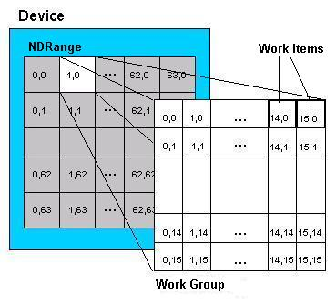

# OpenCL Experiments

This repo goes through 2 OpenCL tutorials to lean how OpenCL programs are built and executed. The following tutorials are here:

- Filtering: https://anteru.net/blog/2012/11/03/2009/
- Matrix multiplication: http://gpgpu-computing4.blogspot.com/2009/09/matrix-multiplication-2-opencl.html

## Instructions

Here are instructions to execute our programs.

```bash
# First, run cmake to create our Makefile.
cmake CMakeLists.txt

# For image filtering, run
make && ./gpu_comparch_final

# For matrix multiplication, run
make && ./matrix_mul
```

## Image Processing

With our current implementation of image processing, we can apply convolution kernels to our images in parallel. In `main.cpp`, the section immediately after `FILTER PROGRAM` contains a set of (commented-out) filters for your use. This is the filter that gets applied on our input `test.ppm` image, where each pixel is transformed concurrently in work-groups (groups of threads per compute unit).

For your convenience, here are the output images, after being processed by our GPU. Feel free to download the code and try your own filters!

### Original image


### Gaussian blur

```c
float filter[] = {
  1, 2, 1,
  2, 4, 2,
  1, 2, 1
};
```


### Sharpen

```c
float filter[] = {
  -1, -1, -1,
  -1, 10, -1,
  -1, -1, -1
};
```


### Dark edges

```c
float filter[] = {
	-1, -1, -1,
	-1,  8, -1,
  -1, -1, -1
};
```


## Matrix Multiplication

Matrix multiplication is another great application for our GPU. In `matrix.cpp`, you can control the following:

```c
// The dimensions of a work-group. This cannot be larger than what the GPU can
// provide (squared). For instance, if your GPU can run 256 threads max, this
// cannot be greater than that.
int MY_LOCAL_WORK_SIZE = 16;

// We generate a random matrix. This is the size of one edge. Based on the
// quirks of this program, it has to be a multiple of MY_LOCAL_WORK_SIZE.
int MY_MATRIX_SIZE = 1024;
```

We can modify our `MY_LOCAL_WORK_SIZE` and see performance changes. That dimension, in our calculation, tells us how big of a block of computation we want to run at a time through our GPU.

Here is a visual of that:



Here is a performance breakdown of varying workgroups.

| MY_LOCAL_WORK_SIZE | MATRIX_SIZE | MICROSECONDS |
|--------------------|-------------|--------------|
| 16                 | 2048        | 1298311      |
| 8                  | 2048        | 1769857      |
| 4                  | 2048        | 1967246      |
| 2                  | 2048        | 4209442      |
| 1                  | 2048        | 15490182     |

As you can see, computation time exponentially decrease as the workgroup size becomes bigger. Since our GPU has the capabilities to run 16**2 or 256 threads at a time, we should take advantage that.
